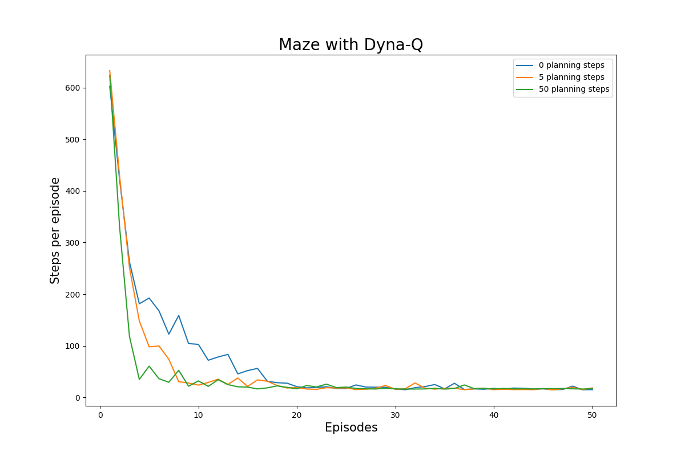

## Dyna maze

The details of the problem can be found in page 164 of the book.
Dyna-Q algorithm integrates learning and planning problem in one.

## Comments
- Use of main() in python
- Running average

## Results

